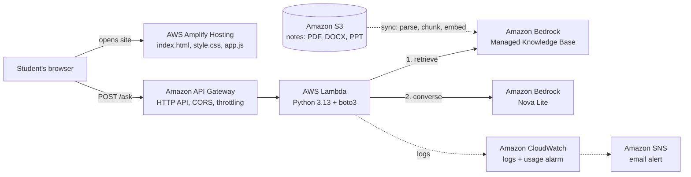

# Campus Study Buddy

A retrieval-augmented generation (RAG) chatbot on AWS. Students upload their course notes, ask
questions, and get answers grounded **only** in those notes, with the source file and page for
every claim.

**Live demo:** https://main.d356wnu1diygyu.amplifyapp.com

Built console-first as a learning project for a campus AWS Student Builder Group.

---

## How it works



1. **Ingest:** notes in S3 are synced into a Bedrock managed Knowledge Base, which parses them
   (including slides and scanned PDFs), splits them into chunks, and embeds each chunk with
   Amazon Titan Text Embeddings V2.
2. **Retrieve:** Lambda calls `retrieve()` to fetch the 10 chunks closest in meaning to the question.
3. **Generate:** Lambda numbers those chunks and sends them to Amazon Nova Lite through the
   `converse()` API, with a strict prompt: answer only from the sources, cite them as `[1]`,
   otherwise reply "I couldn't find that in your notes."
4. **Display:** the web page shows the answer with clickable citation markers and the cited
   file names and page numbers.

Retrieve and generate are deliberately separate calls. Managed knowledge bases don't support
`retrieve_and_generate`, and keeping the two halves of RAG visible makes the project easier to
teach and debug.

## Project structure

```
├── backend/
│   ├── lambda_function.py         Lambda handler: validate → retrieve → generate
│   └── lambda-bedrock-policy.json Least-privilege IAM policy for the Lambda role
├── frontend/
│   ├── index.html                 Page structure
│   ├── style.css                  Notebook theme, dark mode, mobile layout
│   └── app.js                     Calls the API, renders answers and citations
├── docs/
│   ├── cleanup-checklist.md       How to delete every billable resource
│   └── workshop/                  4-session curriculum for a student builder group
├── sample-docs/                   Small example notes for testing
└── plan.md                        The original project brief
```

## Setup (AWS Console, us-east-1)

Prerequisites: an AWS account with MFA on root, an IAM admin user, and a budget alert.

1. **S3:** create a private bucket (Block Public Access on) and upload notes.
   Supported: PDF, DOCX, TXT, MD, HTML, CSV, XLSX. The managed Knowledge Base also parsed PPT/PPTX
   and scanned PDFs in testing.
2. **Bedrock Knowledge Base:** Bedrock → Knowledge Bases → Create → choose the S3 bucket as the data
   source → embeddings: Titan Text Embeddings V2 → create → **Sync**. Note the Knowledge Base ID.
3. **Lambda:** create `study-buddy-ask` (Python 3.13), paste `backend/lambda_function.py`, set
   timeout 30 s and memory 256 MB, and add environment variables:
   | Key | Value |
   |---|---|
   | `KB_ID` | your Knowledge Base ID |
   | `MODEL_ID` | `amazon.nova-lite-v1:0` |
   | `MAX_CHUNKS` | `10` (optional) |
4. **IAM:** add `backend/lambda-bedrock-policy.json` as an inline policy on the Lambda's role.
   Replace the account ID and Knowledge Base ID with yours.
5. **boto3 layer:** Lambda's built-in boto3 may be too old for managed Knowledge Base settings.
   Build a layer and attach it to the function:
   ```bash
   pip install boto3 -t layer/python
   cd layer && zip -r boto3-layer.zip python
   ```
6. **API Gateway:** create an HTTP API with route `POST /ask` → the Lambda. Set CORS
   (allow origin = your Amplify domain, header `content-type`, methods `POST, OPTIONS`) and
   throttling (2 requests/s, burst 5).
7. **Front end:** set `API_URL` at the top of `frontend/app.js`, zip the three files (with
   `index.html` at the zip root), and deploy with Amplify → Deploy without Git.
8. **Hardening:** CloudWatch log retention of 14 days, plus an alarm on Lambda invocations
   (over 200/hour) that emails you through SNS.

Test the API:
```bash
curl -X POST "https://<api-id>.execute-api.us-east-1.amazonaws.com/ask" \
  -H "Content-Type: application/json" \
  -d '{"question":"What is a heuristic function?"}'
```

## Security

- No access keys anywhere: Lambda uses an IAM execution role, and the CLI uses `aws login`
  temporary credentials.
- Least privilege: the Lambda can only `bedrock:Retrieve` on one Knowledge Base and
  `bedrock:InvokeModel` on one model.
- Private S3 bucket with encryption at rest (SSE-S3).
- Server-side input validation: the question must be a string of 1–500 characters.
- CORS is limited to the Amplify domain, and API throttling caps how much the endpoint can cost.
- Logs record question length only, not question text, to protect student privacy.

## Cost (us-east-1, checked October 2026)

| Item | Price | This project |
|---|---|---|
| Nova Lite | $0.06 input / $0.24 output per 1M tokens | about $0.0003 per question |
| Titan Text Embeddings V2 | $0.02 per 1M tokens | under $0.01 per sync |
| Managed Knowledge Base | indexed-data storage plus per-retrieval fee | cents per month at this size |
| Lambda, API Gateway, CloudWatch, SNS | free tier or per-request | about $0 |
| Amplify Hosting, S3 | per GB stored and served | about $0 |

Expect **under $1–2 for the whole build**. Set an AWS Budget before starting.
Bedrock is billed per call, so keep throttling and the usage alarm on while the demo is public.

## Cleanup

See [docs/cleanup-checklist.md](docs/cleanup-checklist.md). The Knowledge Base is the one
resource that keeps billing for storage while idle, so delete it first if you stop using the app.

## Lessons learned

- **Check which account you're in first.** `aws sts get-caller-identity` revealed that the first
  login landed in an AWS Organization member account, where a service control policy blocked
  Bedrock Knowledge Bases. Even admin permissions can't override that.
- **Debug retrieval before the prompt.** A "couldn't find" answer came from fetching only 5 chunks,
  when the definition sat at rank 6–8. Fetching 10 fixed it. Loosening the prompt instead made the
  model start guessing.
- **Lambda's built-in SDK lags behind.** New API settings were silently ignored until a newer boto3
  was bundled as a Lambda layer.

## AWS services used

Amazon Bedrock (Nova Lite, Titan Text Embeddings V2), Amazon Bedrock Knowledge Bases,
AWS Lambda, Amazon API Gateway, AWS Amplify Hosting, Amazon S3, AWS IAM,
Amazon CloudWatch, Amazon SNS, AWS Budgets, AWS CLI.
